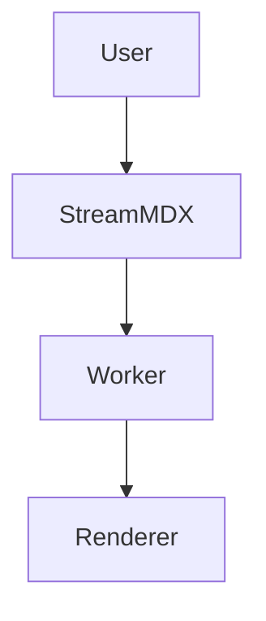

# Mermaid Diagrams

## Why Mermaid is optional

Mermaid can be heavy, so StreamMDX keeps it out of the default bundle. The addon lets you opt in only when you need diagram rendering.

## Install

```bash
npm install @stream-mdx/mermaid
```

## Register the component

Mermaid is implemented as a block renderer for `mermaid` code fences:

```tsx
import { StreamingMarkdown } from "stream-mdx";
import { MermaidBlock } from "@stream-mdx/mermaid";

<StreamingMarkdown
  text={content}
  components={{
    mermaid: MermaidBlock,
  }}
/>
```

## Example fence

```

```

## UX details

The Mermaid block renderer supports a diagram/code toggle. This keeps the raw source accessible while still showing the rendered diagram.

If you want a default view, wrap it:

```tsx
components={{
  mermaid: (props) => <MermaidBlock {...props} defaultView="diagram" />,
}}
```

