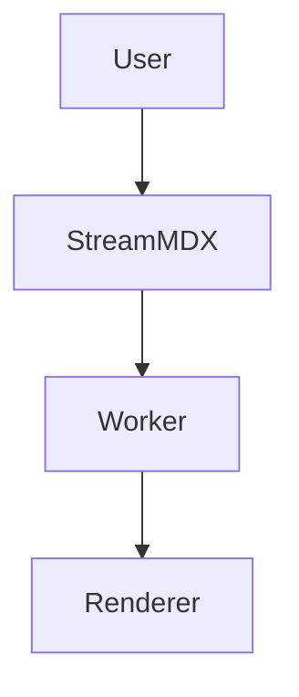

# Mermaid Diagrams

Mermaid is available as an optional addon so teams can opt in only when diagram rendering is needed.

## Why Mermaid is optional

- Keeps default bundle size lower.
- Avoids extra parsing/rendering cost in apps that do not use diagrams.
- Lets teams feature-flag diagram support by route or audience.

## Install

```bash
npm install @stream-mdx/mermaid
```

## Register the component

Mermaid rendering is provided via a block component mapped to `mermaid` code fences.

```tsx
import { StreamingMarkdown } from "stream-mdx";
import { MermaidBlock } from "@stream-mdx/mermaid";

<StreamingMarkdown
  text={content}
  worker="/workers/markdown-worker.js"
  components={{
    mermaid: MermaidBlock,
  }}
  features={{
    html: true,
    tables: true,
    math: true,
    mdx: true,
  }}
/>;
```

## Authoring example

````md

````

## Rendered example


## UX details

The Mermaid block renderer includes a code/diagram toggle by default.

Use `defaultView` to control first render mode:

```tsx
components={{
  mermaid: (props) => <MermaidBlock {...props} defaultView="diagram" />,
}}
```

Recommendations:

- Keep source code view available for debugging and copy/paste.
- Use overflow-safe wrappers on narrow screens.
- Prefer diagram view only for docs pages where the diagram is primary content.

## Performance and safety notes

- Mermaid rendering should remain opt-in and behind a feature toggle in user-facing apps.
- Keep sanitization enabled for surrounding HTML content.
- Include one regression snapshot for a representative Mermaid page.

## Troubleshooting

- **No diagram appears**: verify `@stream-mdx/mermaid` is installed and registered in `components`.
- **Hydration mismatch**: ensure wrappers/components around Mermaid are deterministic.
- **Layout overflow**: add responsive container styles around the diagram block.

## Next steps

- [MDX and HTML in StreamMDX](/docs/guides/mdx-and-html)
- [Testing and baselines](/docs/guides/testing-and-baselines)
- [Performance and backpressure](/docs/guides/performance-and-backpressure)
