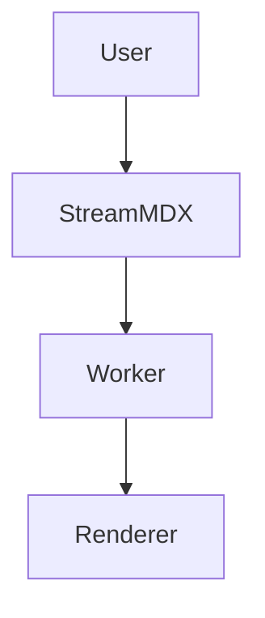

# Mermaid diagrams

Mermaid support is optional by design. StreamMDX keeps the default worker bundle lean, then lets you opt in when diagram rendering is actually needed.

## Why this matters

- Diagram parsing and layout are comparatively heavy; keeping them out of the default path protects throughput.
- Teams can ship Mermaid only to pages that need it and keep normal markdown rendering fast.
- The same worker contract is preserved, so deterministic patch behavior stays intact.

## Install and wire the addon

```bash
npm install @stream-mdx/mermaid
```

```tsx
import { StreamingMarkdown } from "stream-mdx";
import { MermaidBlock } from "@stream-mdx/mermaid";

export function MermaidEnabledArticle({ content }: { content: string }) {
  return (
    <StreamingMarkdown
      text={content}
      worker="/workers/markdown-worker.js"
      components={{
        mermaid: MermaidBlock,
      }}
      features={{ html: true, tables: true, mdx: true, math: true }}
    />
  );
}
```

## Authoring example

````md

````

## Runtime UX

- Mermaid blocks expose a code/diagram toggle so source stays inspectable.
- Parse/render failures degrade safely to readable code instead of breaking the page.
- If your app streams high-frequency content, defer non-critical diagram rendering until after first flush.

## Safety guidance

- Keep Mermaid behind a feature flag in production.
- Avoid untrusted diagram source unless sanitization and trust boundaries are clear.
- For strict CSP environments, host the worker bundle from static assets and avoid `blob:` URLs.

## Next steps

- Guide: [Mermaid diagrams](/docs/guides/mermaid-diagrams)
- API details: [Public API](/docs/public-api)
- Security model: [Deployment and security](/docs/guides/deployment-and-security)
