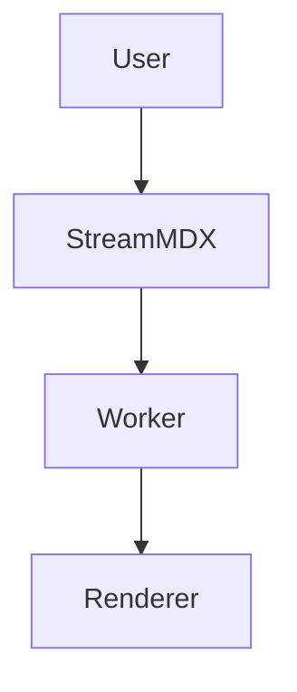

# Mermaid diagrams

Mermaid support is intentionally optional so core StreamMDX installs stay lean.

This showcase demonstrates the integration pattern: keep diagram rendering behind a dedicated component while the rest of the stream path stays unchanged.

## What this showcases

- Optional addon install (`@stream-mdx/mermaid`).
- Component registration for `mermaid` fenced code blocks.
- Safe fallback behavior (code view remains available).

## Install and wire

```bash
npm install @stream-mdx/mermaid
```

```tsx
import { StreamingMarkdown } from "stream-mdx";
import { MermaidBlock } from "@stream-mdx/mermaid";

<StreamingMarkdown
  text={content}
  worker="/workers/markdown-worker.js"
  components={{
    mermaid: MermaidBlock,
  }}
  features={{
    mdx: true,
    html: true,
    tables: true,
    math: true,
  }}
/>;
```

## Authoring contract

Use a normal fenced code block with `mermaid` language:

````md

```mermaid
graph TD
  A[User] --> B[StreamMDX]
  B --> C[Worker]
  C --> D[Renderer]
```
````

## UX guidance

- Keep a **code/diagram toggle** so source remains inspectable.
- Default to code view if your app has strict CSP or heavy initial load pressure.
- Set `defaultView="diagram"` only where diagrams are primary content.

```tsx
components={{
  mermaid: (props) => <MermaidBlock {...props} defaultView="diagram" />,
}}
```

## Operational guidance

- Treat Mermaid like an optional feature flag in production.
- Validate diagram pages on mobile (SVG width and overflow wrappers).
- Include at least one regression snapshot for a representative diagram page.

## Failure mode checklist

- Diagram not rendering: verify addon installed and `components.mermaid` registered.
- Layout overflow: wrap diagram container with horizontal overflow control.
- Hydration drift: avoid non-serializable props in surrounding MDX components.

## Next steps

- Full guide: [Mermaid diagrams guide](/docs/guides/mermaid-diagrams)
- Performance context: [Performance and backpressure](/docs/guides/performance-and-backpressure)
- Testing setup: [Testing and baselines](/docs/guides/testing-and-baselines)
